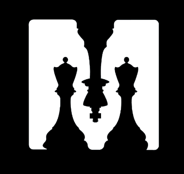

# ♟️	ChessMate
<br />
<br />
<p align="center">
    
  </a>
  
  <h3 align="center"> Project for the course of Mobile Applications and Cloud Computing 2023/2024. </h3>
</p>


# 🏆 Our team:
```
Andrea Panceri, matricola: 1884749

Francesco Sudoso, matricola: 1808353
```
## 🛰️ Micro-Service

The flask micro-service can be reached here -> [link]('https://github.com/Pancio-code/ChessMate-MicroService-MACC') 

## 📖 Report

The report can be reached through this [link]('#')

## 🎮 Manual of the game

The manual of the game can be reached through this [link]('#')


